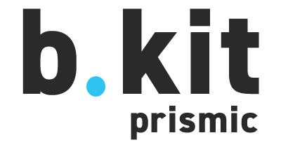

# b.kit MODX

This package provides an interface to connect b.kit components with the MODX CMS. To do so it defines slices that can be imported and used inside e.g. in a react nextjs project.

Our ModxCloud is based on **ContentBlocks** that create JSON-Data that then is consumed by our kit-server template, sliced into perfect data then used to render components from b.kit. We use a lot of **Snippets** to adjust data in the CMS so we have to slice less. Additionally, we use **Chunks** to capsule data.

How a Page is structured is typically set in **Templates**. Those **Templates** use **Chunks** and **Snippets** to form and structure the JSON data.

## Local Testing

Inside library project:

-   Install yalc globally: `yarn global add yalc`
-   Run `yalc publish` to publish library into local yalc store.
-   Run `yalc push` to push changes to all installations

Inside project that should use the library:

-   Run `yalc add <repository-name>` in target lokal repository to link library from yalc store.
-   Use `yalc update` or `yalc update <repository-name>` to update all linked packages.
-   use `yalc remove <repository-name>` to remove linked package.
-   use `yarn --check-files` afterwards to install packages from npm

    Before each push to git `yalc check` performs a check to ensure that all linked packages are removed from package.json. To delete package linking from package.json but not from yalc.lock `yalc retreat [--all]` / `yalc restore`

## ModxCloud
### Setup

Zuerst muss ein Backup des Modx-Masters erstellt werden. Anschließend wird bei modxcloud eine neue Cloud eingerichtet mit dem Namen-Des-Projects DEV. Anschließend wird das Backup des Modx-Masters auf die neu erstellte Cloud aufgespielt. Sobald ein Admin Nutzer über ModxCloud erstellt wurde, ist die Cloud erreichbar.
Anschließend muss die URL innerhalb von Modx (mit der die jewiligen Kontexte erreichbar sein werden) angepasst werden, die Cache Url (Systemeinstellungen) angepasst werden, und die MediaSource Url ebenfalls angepasst werden. Sind diese Schritte alle erfolgt, kann die Cloud an den Kit-Server (per .env) angebunden werden.

#### Steps
1. https://dashboard.modxcloud.com öffnen

2. im Suchfeld `b.kit-modx DEV` oder `master` suchen
   1. Cloud öffnen, unter Reiter `Backups` -> `Create New Backup` und Backup starten

3. `New Cloud`
   1. Name vergeben, hostname kann bleiben sofern nichts anderes gewünscht
   2. Location normalerweise Frankfurt
   3. Version: Möglichst identisch mit dem ModxMaster, so können Probleme verhindert werden (ModxMaster älter als neuste Version (außer 3), eventuell updaten)

4. Zurück zu `Modx Master`
   1. `Backups` -> `Neustes Backup suchen` -> `Zahnrad öffnen` -> `Restore Backup into...` -> `Neue Cloud auswählen und beginnen`
   2. Sobald das Backup wiederhergestellt wurde -> `Neu erstellte Cloud öffnen` -> `Create Admin User`
      1. Username Schema `PartnerKürzel-admin`
      2. Password beliebig
      3. Email leer

5. Sobald der Adminuser erstellt wurde, kann sich damit in der Cloud eingeloggt werden

6. Urls aus der neuen Cloud kopieren (Reiter `Summary`)

7. In der neuen Cloud mit dem Admin einloggen
   1. `Systemeinstellungen` -> `phpthumbof.cache_url` suchen (oder nach `url`) -> neue Cloudurl eintragen (MIT Trailing / )
   2. `Medien` -> `Medienquellen` -> `MediaManager` -> `baseUrl` => `https://neueCloudUrl/mediamanager/`
   3. `WebDefault rechtsklick` -> `Kontext bearbeiten` -> `http_host` => `url.ohneprotocol.ohnetrailing.de`
   4. Für alle Kontexte wiederholen falls `http_host` vorhanden
   5. `next_url` auf Vercel Url oder anderes Deployment pointen
   6. `Clear Cache` -> `Refresh Urls` -> `Rebuild Contentblocks`

### Deployment to LIVE
Zuerst muss eine neue Domain vergeben werden (z.b. meine-modx-cloud.de, Absprache Markus). Anschließend müssen sämtliche Cloud-URLs auf diese neue URL umgestellt werden, siehe Setup Punkt 7. Anschließend muss die neue Adresse im kit-server Projekt eingetragen werden, dann ist das Project ***live***

1. `Cloud öffnen` -> `Domains` -> `Domain vergeben` -> `Auswählen` -> `Create Subdomain` -> `cms` (Vorlage www)

2. In der neuen Cloud mit dem Admin einloggen
   1. `Systemeinstellungen` -> `phpthumbof.cache_url` suchen (oder nach `url`) -> neue Cloudurl eintragen (MIT Trailing / )
   2. `Medien` -> `Medienquellen` -> `MediaManager` -> `baseUrl` => `https://neueCloudUrl/mediamanager/`
   3. `WebDefault rechtsklick` -> `Kontext bearbeiten` -> `http_host` => `url.ohneprotocol.ohnetrailing.de`
   4. Für alle Kontexte wiederholen falls `http_host` vorhanden
   5. `next_url` auf Vercel Url oder anderes Deployment pointen
   6. `Clear Cache` -> `Refresh Urls` -> `Rebuild Contentblocks`

